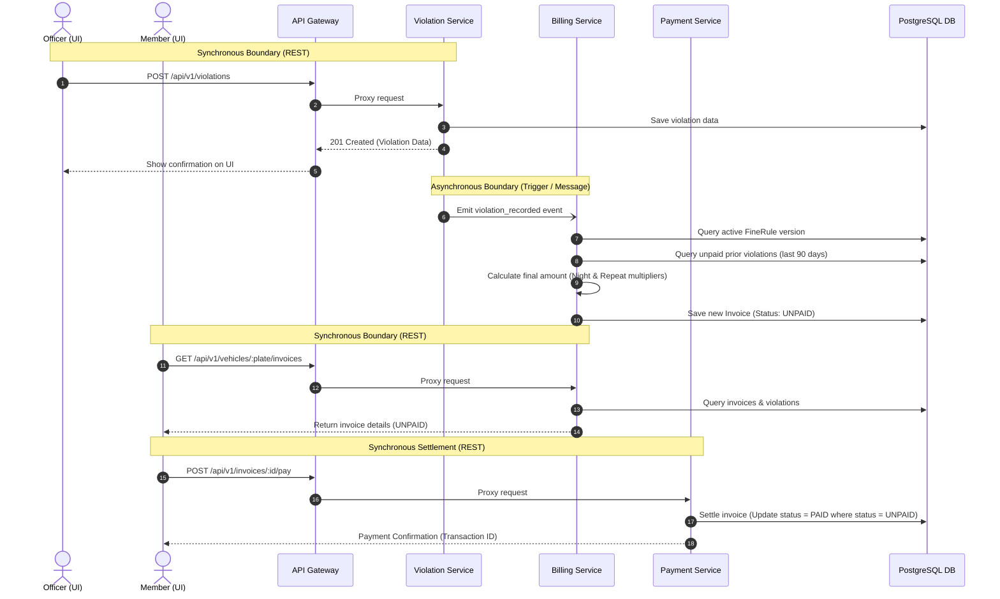
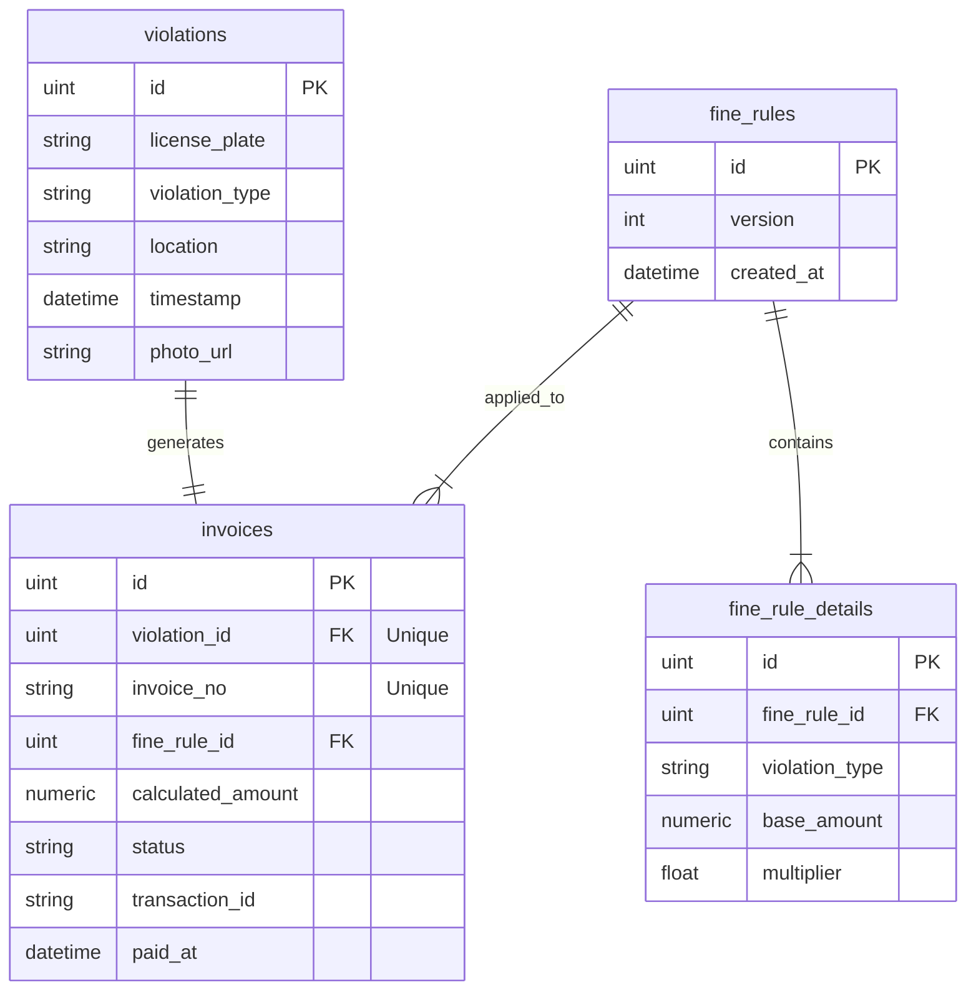

# System Design Document: Municipal Parking Portal

This document outlines the architecture, data flow, and database design of the Municipal Parking Portal, a microservices-based system designed for managing parking violations, billing calculation, and payment settlements.

---

## 1. System Architecture Overview

The system is designed using a decoupled, microservices-based architecture to ensure scalability, fault isolation, and independent service deployability. It consists of the following components:

```
                  ┌───────────────────┐
                  │    Next.js Web    │
                  │   Frontend UI     │
                  └─────────┬─────────┘
                            │ (HTTP/JSON)
                            ▼
                  ┌───────────────────┐
                  │    API Gateway    │ (Port 8080)
                  └────┬────┬────┬────┘
        ┌──────────────┘    │    └──────────────┐
        │ (HTTP Proxy)      │ (HTTP Proxy)      │ (HTTP Proxy)
        ▼                   ▼                   ▼
┌──────────────┐    ┌──────────────┐    ┌──────────────┐
│  Violation   │    │   Billing    │    │   Payment    │
│   Service    │    │   Service    │    │   Service    │
│ (Port 8081)  │    │ (Port 8082)  │    │ (Port 8083)  │
└──────┬───────┘    └──────┬───────┘    └──────┬───────┘
       │                   │                   │
       └─────────────┐     │     ┌─────────────┘
                     ▼     ▼     ▼
                  ┌─────────────────┐
                  │   PostgreSQL    │ (Shared Database / DB Schema)
                  │    Database     │
                  └─────────────────┘
```

### Components Description
1. **API Gateway (Port 8080)**: Act as the single entry point for all frontend requests. It acts as a reverse proxy, parsing HTTP requests and routing them to the appropriate downstream microservice based on URL path prefixes:
   - `/api/v1/violations*` ──> routed to **Violation Service**
   - `/api/v1/invoices*` and `/api/v1/fine-rules*` ──> routed to **Billing Service**
   - `/api/v1/payments*` and `/api/v1/vehicles*` ──> routed to **Payment Service**
2. **Violation Service (Port 8081)**: Manages recording of new parking offenses and vehicle violation history.
3. **Billing Service (Port 8082)**: Evaluates dynamic fine calculation rules, tracks ruleset versioning, and generates invoices with immutable snapshots of historical denda values.
4. **Payment Service (Port 8083)**: Manages the settlement of invoices, integrates with the mock external payment gateway (Success/Failed scenarios), and ensures state transitions are race-condition safe.
5. **Shared Database**: A PostgreSQL database containing schema-isolated or shared tables, utilizing ORM migrations to enforce schema uniformity.

---

## 2. Data Flow Description

The system utilizes both **synchronous** HTTP/JSON API boundaries and **asynchronous** processing paradigms to balance user experience and backend transaction integrity.



### Synchronous Boundaries (HTTP/REST)
- **Violation Submission**: The Officer submits a violation through the UI. The request is proxied through the API Gateway to the Violation Service, which records the offense and responds immediately with a HTTP `201 Created` status containing the violation details.
- **Ruleset Publishing**: An administrator posts a new fine rules config through the Gateway to the Billing Service, which persists the new ruleset version synchronously.
- **Invoice Lookup & Settlement**: The Member queries outstanding invoices by plate number and settles them by sending a POST request to the `/api/v1/invoices/:id/pay` endpoint. The Payment Service synchronously interacts with the Mock Payment Gateway and returns the success/failure state.

### Asynchronous & Event-Driven Process
- **Async Billing Generation**: When a violation is successfully persisted by the Violation Service, an event is emitted (via message queue or async database transaction triggers) to let the Billing Service compile and calculate the invoice without blocking the officer's UI thread.
- **Repeat Offender Logic**: During calculation, the Billing Service scans the database for any unpaid invoices associated with the same license plate created in the **last 90 days**. If found, the repeat offender multiplier is applied.
- **Night-time Multiplier Logic**: The Billing Service parses the violation timestamp in the `Asia/Jakarta` timezone. If the hour is between **22:00 (10 PM)** and **06:00 (6 AM)**, a 1.5x night-time multiplier is applied to the fine.

---

## 3. Database Design & ERD Explanation

The database design ensures that historic financial records remain audit-safe and immutable, even if administrators modify the base fine rates in the future.



### Key Database Entities

#### 1. `violations`
Stores the raw event of a parking infraction.
- `id` (Primary Key)
- `license_plate` (Varchar, indexed)
- `violation_type` (Enum: `EXPIRED_METER`, `NO_PARKING_ZONE`, `BLOCKING_HYDRANT`, `DISABLED_SPOT`)
- `location` (Text)
- `timestamp` (DateTime)
- `photo_url` (Text, optional)

#### 2. `fine_rules` (Versioning Header)
Tracks published versions of the fine system.
- `id` (Primary Key)
- `version` (Integer, auto-incremented on publish)
- `created_at` (DateTime)

#### 3. `fine_rule_details` (Versioning Detail)
Stores the specific base amounts and repeat multipliers for each type under a version.
- `id` (Primary Key)
- `fine_rule_id` (Foreign Key -> `fine_rules.id`)
- `violation_type` (Varchar)
- `base_amount` (Numeric/BigInt)
- `multiplier` (Float)

#### 4. `invoices`
Represents the bill generated for a violation.
- `id` (Primary Key)
- `violation_id` (Foreign Key -> `violations.id`, unique)
- `invoice_no` (Varchar, unique index)
- `fine_rule_id` (Foreign Key -> `fine_rules.id`)
- `calculated_amount` (Numeric/BigInt)
- `status` (Enum: `UNPAID`, `PAID`, `VOIDED`)
- `transaction_id` (Varchar, nullable)
- `paid_at` (DateTime, nullable)

### Enforcing Immutability via Version Locking
To prevent historic invoices from mutating when fine rules are updated, we employ **Version Locking (Transactional Snapshots)**:
1. When a new ruleset is published, a new record is inserted into `fine_rules` (e.g., `version = 2`) with corresponding configuration details in `fine_rule_details`.
2. When the Billing Service generates an invoice for a violation, it retrieves the `version_id` of the ruleset that is **currently active** at the time of calculation.
3. The invoice is created with a hardcoded `calculated_amount` and a foreign key pointing to the specific `fine_rule_id` version used.
4. Subsequent updates to the base amounts or multipliers only create a new `fine_rules` version, leaving existing invoices pointing to their original `fine_rules` records completely untouched.
